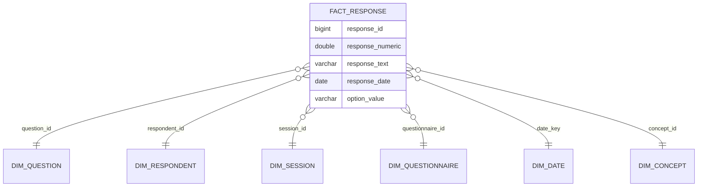

# Analytics & Data Model

The analytical layer in **quickq** is powered by **DuckDB** and provides a standard, high-performance interface for study results.

## The Star Schema

When you run `quickq refresh`, the system performs an ETL (Extract, Transform, Load) process from the SQLite OLTP file into a star schema in DuckDB.

## Key Analytical Features

### 1. Automated Scoring

Scoring rules (like PHQ-9 sum scores) are defined during authoring and automatically calculated during the refresh process. The results are stored in the `agg_respondent_scores` table.

### 2. Standard Aggregates

**quickq** pre-calculates common epidemiology metrics:

*   `agg_question_distribution`: Frequency and percentage distributions for every question.
*   `agg_session_completion`: Daily enrollment and completion rates, with median session duration.
*   `agg_session_completion`: Daily enrollment and completion rates.

### 3. OMOP CDM Integration

For studies requiring integration with larger health data networks, the analytical layer includes views and tables mapped to the **OMOP Common Data Model** (Survey Conduct and Observation tables).

### 4. Cross-Study Harmonization

By leveraging the `concept_id` mapping, researchers can write queries that span multiple studies, even if the questions were phrased differently, as long as they map to the same standard concept.

## Performance

DuckDB's columnar engine allows for near-instantaneous analysis of millions of responses on a standard laptop. It can read the SQLite file directly using its [SQLite extension](https://duckdb.org/docs/extensions/sqlite), making the "refresh" process extremely efficient.
