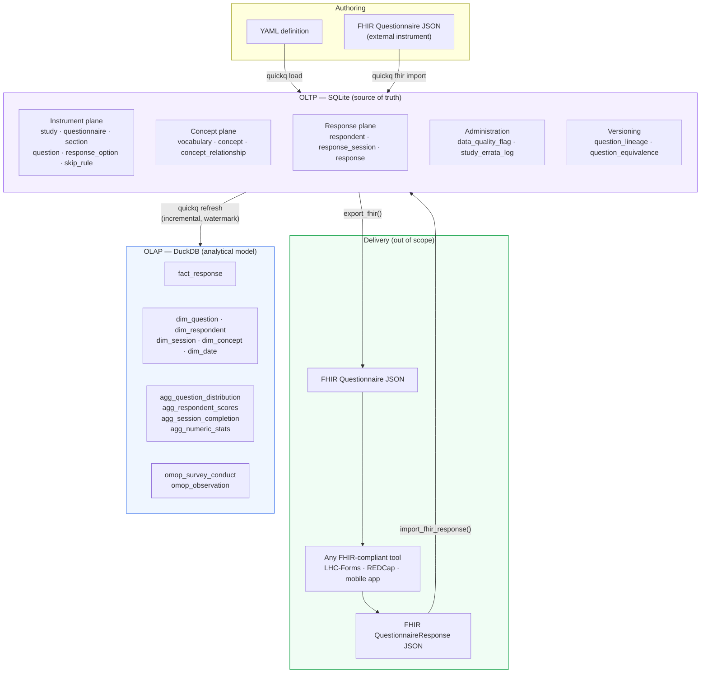

# Architecture

quickq is organized around two local file stores connected by a one-way ETL. There is no application server, no message bus, and no cloud dependency.

---

## System Diagram



---

## OLTP Layer

The SQLite database is organized into five logical planes:

**Instrument plane** — the questionnaire definition hierarchy. `study → questionnaire → section → questionnaire_question → question`. Questions are reusable across instruments; `questionnaire_question` is the placement record. `parent_qq_id` on `questionnaire_question` enables sub-question nesting and the `repeating_group` type (looped question sets).

**Concept plane** — standard vocabulary mapping. Every question, option, grid row, and grid column can carry a `concept_id` linking it to LOINC, SNOMED CT, NCI, BRFSS, or a local vocabulary. The concept model is OMOP-inspired: `vocabulary → concept → concept_relationship`.

**Response plane** — collected answers. `respondent → response_session → response`. One `response` row per answer atom. `repeat_index` distinguishes instances in a repeating group (e.g., pregnancy 1 vs. pregnancy 2). `admin_mode` and `is_proxy` are first-class fields, not metadata, because mode effects are a real covariate in epi analysis.

**Administration** — `data_quality_flag` for automated soft validation during import; `study_errata_log` for human-authored notes about delivery bugs, IRB actions, and post-hoc corrections. Both carry severity levels and analyst guidance.

**Versioning and equivalence** — `question_lineage` tracks revision ancestry (rewords, option changes, splits). `question_equivalence` records researcher-declared cross-instrument equivalences. `questionnaire_version_diff` stores structured diffs between instrument versions.

---

## The FHIR Handoff

quickq owns authoring, administration, and analysis. Delivery is intentionally out of scope.

```
quickq export_fhir(questionnaire_id)
  → valid FHIR Questionnaire R4 JSON
    → delivered by any FHIR-compliant tool
      → FHIR QuestionnaireResponse JSON returned
        → quickq import_fhir_response(conn, resource)
          → response rows written to OLTP
```

The reference delivery tool is **[LHC-Forms](https://lhncbc.nlm.nih.gov/LHC-forms/)** (NLM) — purpose-built for FHIR Questionnaire rendering, open source, embeddable as a JavaScript widget with no server dependency. Any FHIR-compliant tool works; LHC-Forms is what the E2E test suite validates against.

`import_fhir_response` is robust by design: unrecognized `linkId` values, unknown answer formats, and missing concept codes are written to `data_quality_flag` rather than raising exceptions.

---

## OLAP Refresh

`quickq refresh` reads new OLTP rows since the last run (incremental by `response_id` watermark stored in `refresh_log`) and upserts into DuckDB. It runs the ETL, computes scores via `scoring_rule`, materializes aggregate tables, and (when `person_map` is populated) generates OMOP extraction tables.

DuckDB attaches the SQLite file directly:

```sql
ATTACH 'study.db' AS oltp (TYPE sqlite, READ_ONLY);
```

There is no intermediate export step, no staging database, and no message queue. The OLTP file is the ETL source.

A failed refresh leaves `refresh_log.status = 'failed'` and does not advance the watermark. The next run retries the same window cleanly.

---

## File Layout

A complete study consists of exactly two files:

| File | Contents |
|---|---|
| `study.db` | SQLite OLTP — instrument definitions, responses, data quality, versioning |
| `study_analytics.duckdb` | DuckDB OLAP — star schema, aggregates, scores, OMOP tables |

Both are standard database files openable in any SQL tool. `study.db` alone is sufficient to re-derive the entire OLAP from scratch.
