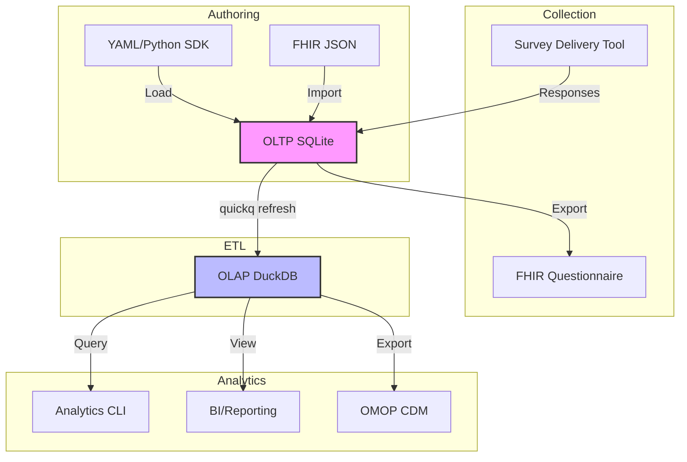

# Architecture

**quickq** follows a two-tier architecture that separates data collection from data analysis.

## System Overview

The following diagram illustrates the flow of data from authoring to analysis.

## The Two Layers

### 1. The Transactional Layer (OLTP)

Managed by **SQLite**, this layer is the source of truth for the study structure and raw response data. It is highly normalized to prevent data anomalies during the collection phase. It implements the "Instrument Plane," "Concept Plane," and "Response Plane."

### 2. The Analytical Layer (OLAP)

Managed by **DuckDB**, this layer is populated on-demand via the `quickq refresh` command. DuckDB is uniquely suited for this as it can directly attach and read from the SQLite file. This layer transforms the normalized data into a standard star schema, pre-calculates scores, and generates aggregate tables.

## Portability

Because both layers reside in local files, a researcher can commit the entire state of a study (including the analytics engine) to a version control system or share it as a single archive.
