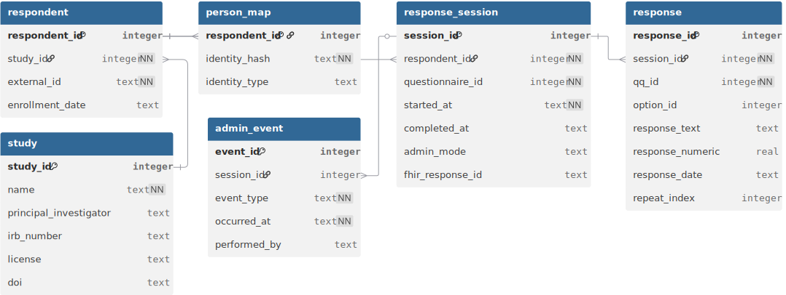
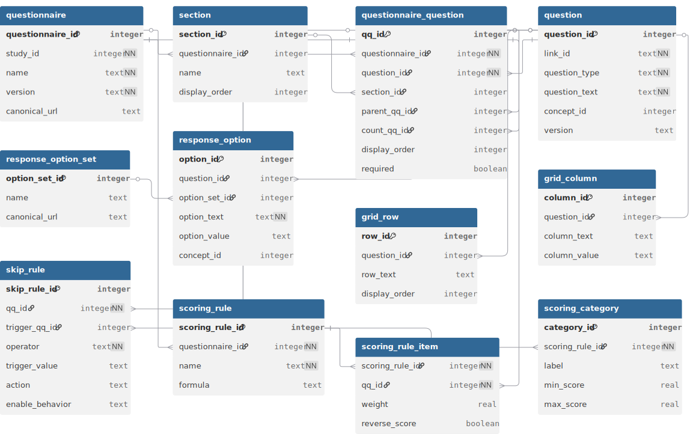
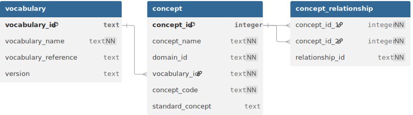
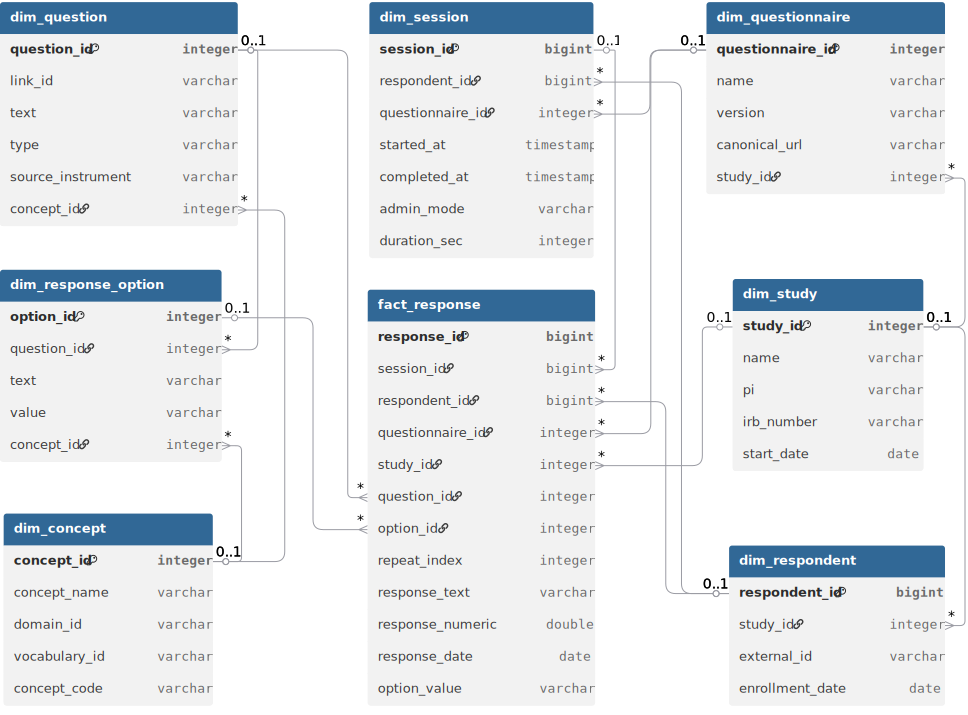
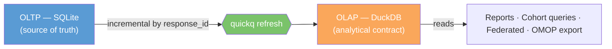

# The quickq Data Model

quickq's data model has two halves connected by a refresh.

The **OLTP** half (SQLite) is the *source of truth*. It stores every authored instrument, every collected response, and every piece of provenance about how the study was run. One `.db` file is the complete portable study artifact.

The **OLAP** half (DuckDB) is the *analytical projection*. It is rebuilt on demand from OLTP by `quickq refresh`. Every report, dashboard, federated query, and cross-study harmonization runs against OLAP — never against the OLTP file directly. The OLAP schema is stable and standardized; the OLTP schema is normalized and intentionally allowed to evolve over time.

Each half has logical layers — distinct concerns that compose into the full model. The diagrams on this page show those layers individually rather than overwhelming you with a single 40-table chart. For the full table-by-table reference, see [OLTP Schema](oltp.md) and [OLAP Schema](olap.md).

!!! note "Why per-layer diagrams"
    Real-world cohort study databases run to 30–50 tables. A single diagram that tries to show all of them either crops out the columns that matter or routes lines through other tables. We adopt the OMOP CDM convention: one diagram per logical layer, with clear callouts where the layers connect. Each diagram below shows the most informative columns per table; the SQL DDL has the rest.

---

## OLTP — what's collected

Four layers. Together they answer *what was authored, what was collected, what does each value mean, and how do we know it's trustworthy*.

### 1. Study and response flow

The data-collection lifecycle. A `study` has many `respondent`s; each respondent has many `response_session`s; each session has many `response`s. `admin_event` records dispatch / reminder / mode-change activity around a session. `person_map` is a separate identity index for studies that need linkable identity outside the response_session table.

This layer is the entry point for almost every analytical question: "how many respondents", "how many sessions per respondent", "what's the completion rate by admin mode". The integer surrogate keys (`respondent_id`, `session_id`) are quickq's; the `external_id` on `respondent` is the study-assigned participant identifier that researchers actually recognize.

### 2. Instrument definition

What the questionnaire actually asks. A `questionnaire` has `section`s; each section has `questionnaire_question` placements (the verb is "places this question here, in this order, with these skip rules and scoring weights"); each placement points to a reusable `question`. Options for choice questions live in `response_option`, optionally grouped into shared `response_option_set`s. Grid questions use `grid_row` × `grid_column`. Skip logic is structured in `skip_rule`. Scoring is structured in `scoring_rule` / `scoring_rule_item` / `scoring_category`.

The reuse pattern is intentional: a question (LOINC `44250-9` "Little interest or pleasure in doing things") can be *placed* in many questionnaires under the same `link_id` with different display order, required flag, or scoring weight. That separation between *the question* and *the question's placement* is what makes harmonization across instruments possible.

`questionnaire_question.parent_qq_id` and `count_qq_id` together support repeating-group questions: parent_qq_id chains the children into a group, count_qq_id links the group to a numeric question that drives N. The `skip_rule` table is the structured form of FHIR's `enableWhen` and is what every cross-instrument skip-logic recipe queries against.

### 3. Vocabulary

Standard concept codes for cross-study harmonization. Modeled directly on OMOP CDM v5.4: a `vocabulary` (LOINC, SNOMED, NCI, BRFSS, Local) groups `concept`s identified by `(vocabulary_id, concept_code)`, with `concept_id` as the surrogate. `concept_relationship` rows encode "Maps to", "Is a", "Subsumes", "Answer of".

Every `question`, `response_option`, `grid_row`, and `grid_column` may reference a `concept_id` (the FK is shown in the instrument diagram, not redrawn here). When two studies use the same LOINC code on the same construct, joining their data is a single SQL JOIN. When they don't, the `concept_relationship` table makes the mapping explicit instead of folkloric.

The vocabulary plane is small (three tables) but it is the single most important integration surface: it is what makes a quickq study composable with OMOP cohorts, REDCap projects with codings, and FHIR Implementation Guides.

### 4. Provenance and quality

How questions evolved, what data quality issues were flagged, who did what to the database. `question_lineage` tracks rewords / option changes / splits / merges / adapted_from edges between question versions. `question_equivalence` declares which questions can be pooled across versions. `questionnaire_version_diff` records cross-version structural changes. `data_quality_flag` is written at collection time when the FHIR ingester rejects an answer. `study_errata_log` is the researcher's hand-recorded "we discovered after the fact that sessions 1–20 had a delivery bug" log. `tool_audit_log` records every quickq command that touched the database.

| Table | Purpose | Key columns |
|---|---|---|
| `question_lineage` | Edges between question versions: reword, option_change, split, merge, adapted_from | lineage_id, question_id, parent_question_id, change_type |
| `question_equivalence` | Declares which questions can be pooled across versions | equivalence_id, source_question_id, target_question_id, equivalence_type |
| `questionnaire_version_diff` | Cross-version structural changes at questionnaire level | diff_id, source_questionnaire_id, target_questionnaire_id, change_type |
| `data_quality_flag` | Written at collection time when the FHIR ingester rejects an answer | flag_id, session_id, qq_id, severity, description, raised_at |
| `study_errata_log` | Researcher's hand-recorded errata (delivery bugs, batch issues, retracted sessions) | errata_id, study_id, severity, title, status, raised_at |
| `tool_audit_log` | Every quickq command that touched the database | audit_id, study_id, operation, performed_by, occurred_at |

This layer is what lets a researcher answer "what changed between v1 and v2 of the instrument", "did this respondent's responses get flagged at any point", and "when was this database last modified, by what command". The lineage and equivalence tables propagate to the OLAP `dim_question_lineage` and `dim_question_equivalence` so analytical queries can use them too.

---

## OLAP — what's derived

Four layers, all rebuilt by `quickq refresh`. The OLAP schema is the *contract* analytical tooling depends on: it is stable across releases, while the OLTP schema is allowed to evolve.

### 1. Star schema

The analytical core. `fact_response` is one row per answer atom; the eight `dim_*` tables are the standard star points. Every analytical query starts with a SELECT against fact_response and joins outward to the dimensions.

Several things to notice:

- **The same query shape works for every question type and every instrument.** A SELECT on `fact_response` joined to `dim_question` and `dim_response_option` answers "what's the distribution of answers to this question" regardless of whether the question is a single_choice, multiple_choice, likert, or boolean. That uniformity is what makes the star-schema model worth the redundancy of a wide fact table.
- **Snowflake edges connect the dimensions to each other.** `dim_session → dim_respondent → dim_study` and `dim_session → dim_questionnaire → dim_study` form two parallel paths up to study, which is what enables study-level rollups without aggregating from facts. `dim_question → dim_concept` and `dim_response_option → dim_concept` make concept-based harmonization a JOIN, not a custom script.
- **`fact_response` carries `repeat_index`.** For repeating-group questions (a pregnancy history loop, an occupational history loop), each instance gets a 0-based index so per-instance aggregation works in standard SQL.

The `dim_date` table participates in two date-keyed joins (`fact_response.response_date_key`, `fact_response.session_start_key`) that aren't drawn here because those columns are part of the "+ 12 more columns" trim — see the OLAP schema reference for the full fact table.

### 2. Aggregates

Materialized rollups. Each `agg_*` table is a precomputed answer to a recurring analytical question, joinable to the same dim_* tables shown in the star schema.

| Table | Purpose | Key columns |
|---|---|---|
| `agg_question_distribution` | One row per (question, answer) — counts and percentages | study_id, questionnaire_id, question_id, option_id, n, pct |
| `agg_session_completion` | Daily enrollment and completion rollup by admin_mode | study_id, questionnaire_id, date_key, n_started, n_completed, completion_rate, median_duration_sec |
| `agg_respondent_scores` | One row per (respondent, session, scoring_rule) — raw score and severity band | respondent_id, scoring_rule_id, scoring_rule_name, score_raw, score_category, items_answered |
| `agg_numeric_stats` | Per-question numeric summary (mean, median, std_dev, percentiles) | study_id, question_id, n, mean, median, std_dev, min_val, max_val |

- **`agg_question_distribution`** — for each (question, option), how many respondents picked it and what percentage. This is what `quickq report` reads to produce the per-question distribution tables.
- **`agg_session_completion`** — daily enrollment and completion rates broken down by `admin_mode`. This is the "are people finishing the survey?" view.
- **`agg_respondent_scores`** — one row per (respondent, session, scoring_rule). Stores the computed raw score and the severity category (PHQ-9 "moderate", GAD-7 "mild"). This is what cohort queries read to filter by score band.
- **`agg_numeric_stats`** — n / mean / median / std_dev / quartiles for every numeric question. Avoids re-aggregating from facts when the answer is the same shape every time.

Aggregates are recomputed in full on every `quickq refresh`. They exist for query performance and for standardization (every site, every report, every downstream tool reads the same definition of "PHQ-9 mean score").

### 3. OMOP interoperability

OMOP CDM v5.4-aligned tables, projected from the star schema for cross-study harmonization with other OMOP cohorts.

| Table | Purpose | Key columns |
|---|---|---|
| `omop_observation` | Every fact_response with a question concept_id projects here. Values resolve across `value_as_number` (numeric), `value_as_concept_id` (choice), and the date columns. `person_id` is `respondent_id`. | observation_id, person_id, observation_concept_id, observation_date, value_as_number, value_as_concept_id |
| `omop_survey_conduct` | Every response_session projects here — which respondent took which questionnaire, when, for how long | survey_conduct_id, person_id, survey_concept_id, survey_start_date, survey_end_date |
| `omop_unmapped_questions` | Questions without a concept_id, surfaced as the actionable list before federated export | question_id, link_id, question_text, source_instrument |

- **`omop_observation`** — every fact_response row that has a question concept_id projects into observation. This is what an OMOP-native analyst expects to query, by `observation_concept_id`, with the value resolved across `value_as_number` (numeric responses), `value_as_concept_id` (choice responses), and the date-typed columns. `person_id` here is `respondent_id` from quickq's perspective.
- **`omop_survey_conduct`** — every response_session projects into survey_conduct. This is the "which respondent took which questionnaire, when, for how long" view.
- **`omop_unmapped_questions`** — surfaces questions that don't have a `concept_id` and therefore can't project into observation. This is the actionable list for a researcher preparing to share data: map these before federated export.

The OMOP layer is *additive*. quickq's native star schema (above) is the analytical contract for quickq itself; the OMOP layer is the bridge to the broader OHDSI ecosystem. Studies that don't need OHDSI compatibility can ignore the omop_* tables entirely.

### 4. Provenance

Three small tables that record how the OLAP was built and how its dimensions evolved.

| Table | Purpose | Key columns |
|---|---|---|
| `refresh_log` | One row per `quickq refresh` invocation | refresh_id, started_at, completed_at, rows_inserted, rows_updated |
| `dim_question_lineage` | Mirrors OLTP `question_lineage`. Lets analytical queries walk the parent chain to find earlier versions of the same construct. | lineage_id, question_id, parent_question_id, change_type |
| `dim_question_equivalence` | Mirrors OLTP `question_equivalence`. Lets cross-study cohort queries pool semantically equivalent questions across versions. | equivalence_id, source_question_id, target_question_id, equivalence_type |

- **`refresh_log`** — one row per `quickq refresh` invocation. Captures start / end timestamps, rows inserted, rows updated. Useful for "when was this analytical database last refreshed".
- **`dim_question_lineage`** — mirrors OLTP `question_lineage`. Lets an analytical query that touches `dim_question` walk up the parent chain to find an earlier version of the same construct.
- **`dim_question_equivalence`** — mirrors OLTP `question_equivalence`. Lets a cross-study cohort query pool semantically equivalent questions across instrument versions.

The provenance layer is small but it is what makes "why did this score change between refreshes" and "show me the v1 question this v2 question replaces" answerable in standard SQL.

---

## How OLTP becomes OLAP

The bridge between the two halves is `quickq refresh`. It reads the OLTP file via DuckDB's native SQLite extension, applies a small set of transformations, and writes the standardized OLAP tables.

The refresh is **incremental** by `response_id` watermark — only newly arrived responses are processed on subsequent runs. It is **on-demand**, not streaming: appropriate for batch / research workflows. It is **lossy in one direction**: the OLAP can be regenerated entirely from OLTP at any time, but the OLTP cannot be regenerated from OLAP. The portable study artifact is always the SQLite file.

For implementation detail, see [Architecture](../architecture.md#olap-refresh).

---

## Going deeper

- **Full column-by-column reference**: [OLTP Schema](oltp.md), [OLAP Schema](olap.md).
- **Architecture decisions** (why two stores, why FHIR is the boundary, why scoring is in OLTP not OLAP): [Architecture](../architecture.md), [Design Decisions](../design_decisions.md).
- **Query patterns by question type**: [Query Patterns Reference](../reference/query-patterns.md).
- **Diagram source**: the `.dbml` files under `docs/database/source/` are the editable source for the diagrams above. They open directly in [dbdiagram.io](https://dbdiagram.io/d) for layout adjustments.
