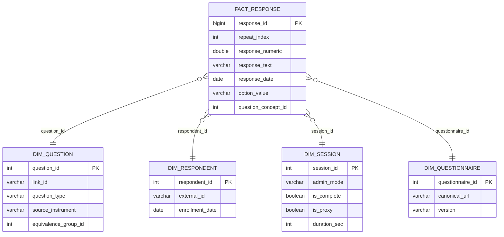

# OLAP Schema (DuckDB)

The OLAP database is the **standard analytical surface** for quickq. All reports, cohort queries, and cross-study analyses run here — never against the OLTP SQLite file directly. It is populated on demand via `quickq refresh`, which reads the SQLite file directly using DuckDB's native SQLite extension.

```sql
ATTACH 'study.db' AS oltp (TYPE sqlite, READ_ONLY);
```

---

## Core Schema

One fact table surrounded by four key dimensions handles the vast majority of analytical queries.



**`fact_response`** — One row per answer atom, mirroring the OLTP `response` table but pre-joined with concept and dimension keys so analytical queries need no joins back to SQLite. `repeat_index` carries through from OLTP: `NULL` for non-repeating questions, 0-based for `repeating_group` children. `question_concept_id` and `option_value` are denormalized onto every row so concept-based and value-based filters are a single `WHERE` clause.

**`dim_question`** — Question metadata. `source_instrument` records provenance (e.g., `PHQ-9`, `BRFSS-2022`). `equivalence_group_id` is a computed cluster ID — the connected-component of the `question_equivalence` graph — that lets a query span instruments without knowing their `link_id` values.

**`dim_respondent`** — De-identified participant. `external_id` is the researcher-assigned key, matching OLTP.

**`dim_session`** — Session-level covariates. `admin_mode` and `is_proxy` are first-class columns because mode effects matter in epi analysis. `duration_sec` is derived from `completed_at - started_at`.

**`dim_questionnaire`** — Instrument version context. `canonical_url` + `version` are the stable identifiers for joining across studies.

---

## Supporting Tables

### Additional dimensions

**`dim_study`** — Study-level filter (`study_id`, `irb_number`, `principal_investigator`). Useful when a DuckDB file aggregates multiple studies.

**`dim_response_option`** — Answer choice metadata: `option_value`, `concept_id`, `is_other`, `is_exclusive`. Needed for queries that filter or label by option properties rather than just value.

**`dim_concept`** — Standard vocabulary reference (`vocabulary_id`, `concept_code`, `standard_concept`). Populated from OLTP `concept`; used for concept-based cross-study joins.

**`dim_date`** — Calendar dimension (`year`, `quarter`, `month`, `week`, `is_weekend`). `fact_response` carries `response_date_key` and `session_start_key` as foreign keys into this table for time-series grouping.

### Aggregate tables

Aggregates are materialized on every `quickq refresh`. Prefer them over scanning `fact_response` for dashboards and reports.

**`agg_question_distribution`** — Response frequency and percentage per `(study, questionnaire, question, option_value)`. `pct` denominator is sessions with any answer to that question.

**`agg_numeric_stats`** — Descriptive statistics for numeric questions: `mean`, `median`, `std_dev`, `min_val`, `max_val`, `p25`, `p75`.

**`agg_session_completion`** — Daily enrollment and completion rates broken down by `admin_mode`. Includes `completion_rate` (0–1) and `median_duration_sec`.

**`agg_respondent_scores`** — Computed scale scores (PHQ-9 total, GAD-7 severity, SF-12, etc.) per respondent per session per scoring rule. `items_answered / items_total` makes partial-completion analysis straightforward.

### Versioning mirrors

**`dim_question_lineage`** — Revision ancestry mirrored from OLTP: rewords, option changes, splits, merges. For provenance-aware queries that need to know when a question changed.

**`dim_question_equivalence`** — Declared equivalences mirrored from OLTP, both directions stored. Used to compute `equivalence_group_id` on `dim_question`.

### OMOP extraction

For studies in federated networks (PCORnet, TriNetX, i2b2), three tables project data into OMOP CDM format. Populated during refresh when `person_map` is populated in the OLTP.

**`omop_survey_conduct`** — One row per session. Maps to the OMOP `SurveyConducts` domain.

**`omop_observation`** — One row per response atom that has a `concept_id`. Maps to the OMOP `Observations` domain.

**`omop_unmapped_questions`** — Questions excluded from OMOP output due to missing `concept_id`, with their `response_count`. This is the pre-flight data quality check before any federated query: high counts mean real data is being silently excluded.

```sql
-- Find mapping gaps before a federated export
SELECT link_id, question_text, response_count
FROM omop_unmapped_questions
ORDER BY response_count DESC;
```

### Refresh watermark

**`refresh_log`** — One row per refresh run. `max_response_id` is the high-water mark: the next run reads `response_id > this value`. A failed run leaves `status = 'failed'` and does not advance the watermark, so the next run retries the same window cleanly. `error_message` is populated on failure so the cause is inspectable without log files.
