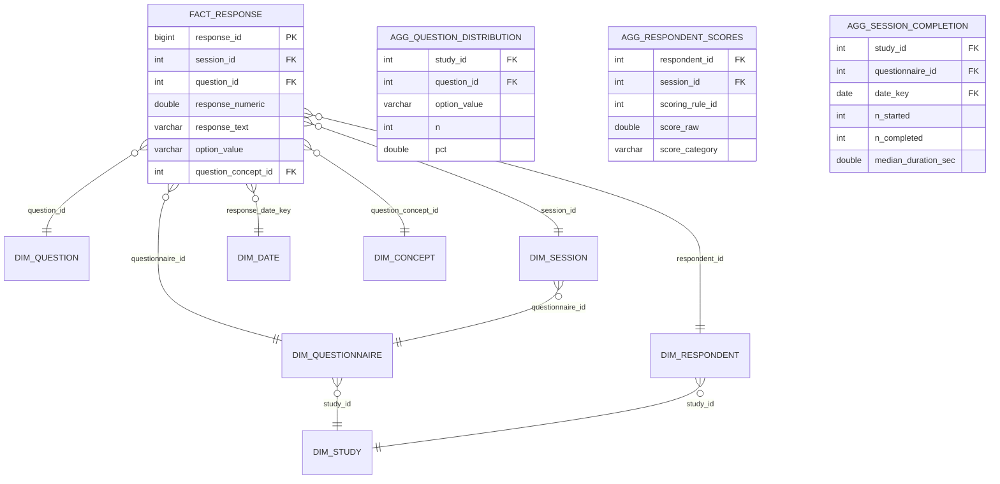

# OLAP Schema (DuckDB)

The OLAP schema is optimized for analytical performance and follows a star schema design.

## Diagram

## Features

### Fact-Dimension Design

The `fact_response` table contains the core "atoms" of data (answers). The dimensions (`dim_*`) provide the descriptive context needed for filtering and grouping.

### Denormalization

Unlike the OLTP schema, the OLAP schema is heavily denormalized. Concept names, questionnaire versions, and respondent IDs are pre-joined to ensure that analytical queries are fast and simple to write.

### Aggregates

Aggregate tables (`agg_*`) are materialized during the `refresh` process. These provide instant access to high-level study metrics without needing to scan the entire `fact_response` table.

### OMOP Compatibility

The `omop_survey_conduct` and `omop_observation` tables/views provide a projection of the study data that matches the OHDSI OMOP Common Data Model, facilitating participation in multi-center research networks.
