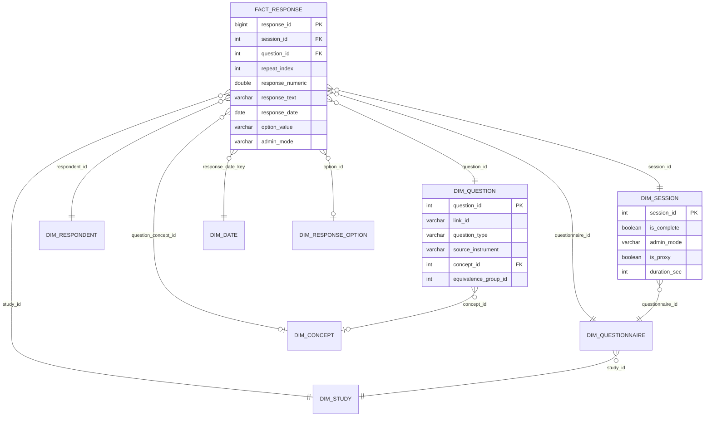

# OLAP Schema (DuckDB)

The OLAP database is the **standard analytical surface** for quickq. All reports, cohort queries, and cross-study analyses run here — never against the OLTP SQLite file directly. It is populated on demand via `quickq refresh`, which reads the SQLite file directly using DuckDB's native SQLite extension.

```sql
ATTACH 'study.db' AS oltp (TYPE sqlite, READ_ONLY);
```

---

## Star Schema



---

## Fact Table

`fact_response` holds one row per answer atom — the same granularity as the OLTP `response` table, but pre-joined with concept and dimension keys so analytical queries need no joins to OLTP.

| Column | Type | Notes |
|---|---|---|
| `response_id` | BIGINT PK | Mirrors OLTP `response.response_id` |
| `session_id` | INTEGER | FK → `dim_session` |
| `respondent_id` | INTEGER | FK → `dim_respondent` |
| `questionnaire_id` | INTEGER | FK → `dim_questionnaire` |
| `study_id` | INTEGER | FK → `dim_study` |
| `question_id` | INTEGER | FK → `dim_question` |
| `qq_id` | INTEGER | Placement key; preserves version context |
| `option_id` | INTEGER | NULL for open / numeric / date answers |
| `grid_row_id` / `grid_column_id` | INTEGER | Grid cell coordinates |
| `repeat_index` | INTEGER | NULL for non-repeating; 0-based instance index for `repeating_group` |
| `response_text` | VARCHAR | Boolean (`'true'`/`'false'`), text, coded answers |
| `response_numeric` | DOUBLE | Numeric, slider, ranked ordinal |
| `response_date` | DATE | Date and datetime answers |
| `option_value` | VARCHAR | Denormalized from `response_option` for filter speed |
| `question_concept_id` | INTEGER | Pre-joined; enables concept-based cross-study queries without joins |
| `option_concept_id` | INTEGER | Pre-joined option concept |
| `response_date_key` / `session_start_key` | DATE | FK → `dim_date` |
| `admin_mode` | VARCHAR | `web` / `paper` / `phone` / `kiosk` / `api` — covariate for mode-effect analysis |
| `is_proxy` | BOOLEAN | Proxy response flag |
| `loaded_at` | TIMESTAMP | ETL load time |

---

## Dimension Tables

| Table | Key columns | Purpose |
|---|---|---|
| `dim_study` | `study_id`, `irb_number`, `pi` | Study-level filter |
| `dim_questionnaire` | `questionnaire_id`, `canonical_url`, `version` | Instrument version context |
| `dim_question` | `link_id`, `question_type`, `source_instrument`, `concept_id`, `equivalence_group_id` | Question metadata and cross-study grouping |
| `dim_response_option` | `option_id`, `option_value`, `concept_id`, `is_other`, `is_exclusive` | Answer choice metadata |
| `dim_respondent` | `respondent_id`, `external_id`, `enrollment_date` | Participant-level filter |
| `dim_session` | `session_id`, `is_complete`, `admin_mode`, `duration_sec` | Session-level covariates |
| `dim_date` | `date_key`, `year`, `quarter`, `month`, `week`, `is_weekend` | Time-series grouping |
| `dim_concept` | `concept_id`, `vocabulary_id`, `concept_code`, `standard_concept` | Standard vocabulary reference |

### Cross-study harmonization via `equivalence_group_id`

`dim_question.equivalence_group_id` is a computed cluster ID — the connected-component ID of the `question_equivalence` graph. Questions in the same group can be treated as measuring the same construct:

```sql
-- Prevalence of PHQ-9 "little interest" across studies,
-- regardless of exact question wording or instrument version
SELECT study_id, AVG(response_numeric) AS mean_score
FROM fact_response fr
JOIN dim_question dq USING (question_id)
WHERE dq.equivalence_group_id = 42
GROUP BY study_id;
```

---

## Aggregate Tables

Aggregates are materialized on every `quickq refresh`. Prefer these over scanning `fact_response` for dashboards and reports.

### `agg_question_distribution`
Response frequency distribution per question. One row per `(study, questionnaire, question, option_value)`. `pct` denominator is sessions with any answer to that question.

### `agg_numeric_stats`
Descriptive statistics for numeric questions: `mean`, `median`, `std_dev`, `min_val`, `max_val`, `p25`, `p75`.

### `agg_session_completion`
Daily enrollment and completion rates, broken down by `admin_mode`. Includes `completion_rate` (0–1) and `median_duration_sec`.

### `agg_respondent_scores`
Computed scores per respondent per scoring rule (PHQ-9 sum, GAD-7 severity, etc.). Populated by evaluating `scoring_rule` + `scoring_rule_item` from OLTP. Includes `items_answered` / `items_total` so partial-completion analysis is straightforward.

---

## Versioning & Equivalence

Two mirror tables are populated during refresh for OLAP-side provenance queries:

- **`dim_question_lineage`** — revision ancestry (rewords, option changes, splits, merges)
- **`dim_question_equivalence`** — declared equivalences between questions, both directions stored

---

## OMOP Extraction

For studies participating in multi-center networks, three tables project data into OMOP CDM format:

| Table | Maps to | Notes |
|---|---|---|
| `omop_survey_conduct` | `SurveyConducts` domain | One row per session |
| `omop_observation` | `Observations` domain | One row per response atom with a `concept_id` |
| `omop_unmapped_questions` | — | Questions excluded from OMOP export due to missing `concept_id` |

`omop_unmapped_questions` is a data quality surface: it shows exactly what needs to be mapped before a study can contribute to a federated network query. Questions with high `response_count` and no `concept_id` are the priority mapping targets.

OMOP extraction requires `person_map` to be populated in the OLTP database (linking `respondent.external_id` to `omop_person_id`). This is intentionally study-specific ETL — quickq populates the OMOP tables but does not own the identity resolution.

---

## Refresh Watermark

`refresh_log` tracks every incremental load:

| Column | Purpose |
|---|---|
| `max_response_id` | High-water mark — next refresh reads `response_id > this value` |
| `max_session_id` | Session high-water mark for session-level tables |
| `rows_loaded` | Audit count for each run |
| `status` | `running` / `complete` / `failed` |
| `error_message` | Populated on failure so the cause is inspectable without log files |

A failed refresh leaves `status = 'failed'` and does not advance the watermark, so the next run retries the same window cleanly.

---

## Data Quality at the Analytical Layer

!!! tip "OMOP unmapped questions are a first-class data quality signal"
    Before running any cross-study query, check `omop_unmapped_questions` for the relevant instruments. High response counts on unmapped questions mean your query is silently excluding real data.

The OLAP layer surfaces three quality signals that have no equivalent in OLTP:

1. **`omop_unmapped_questions`** — concept mapping gaps that block federated queries
2. **`agg_respondent_scores.items_answered / items_total`** — partial completion rate per scoring rule, indicating systematic skip patterns or delivery bugs
3. **`dim_question.equivalence_group_id = NULL`** — questions with no declared equivalences; candidates for mapping before cross-study analysis
