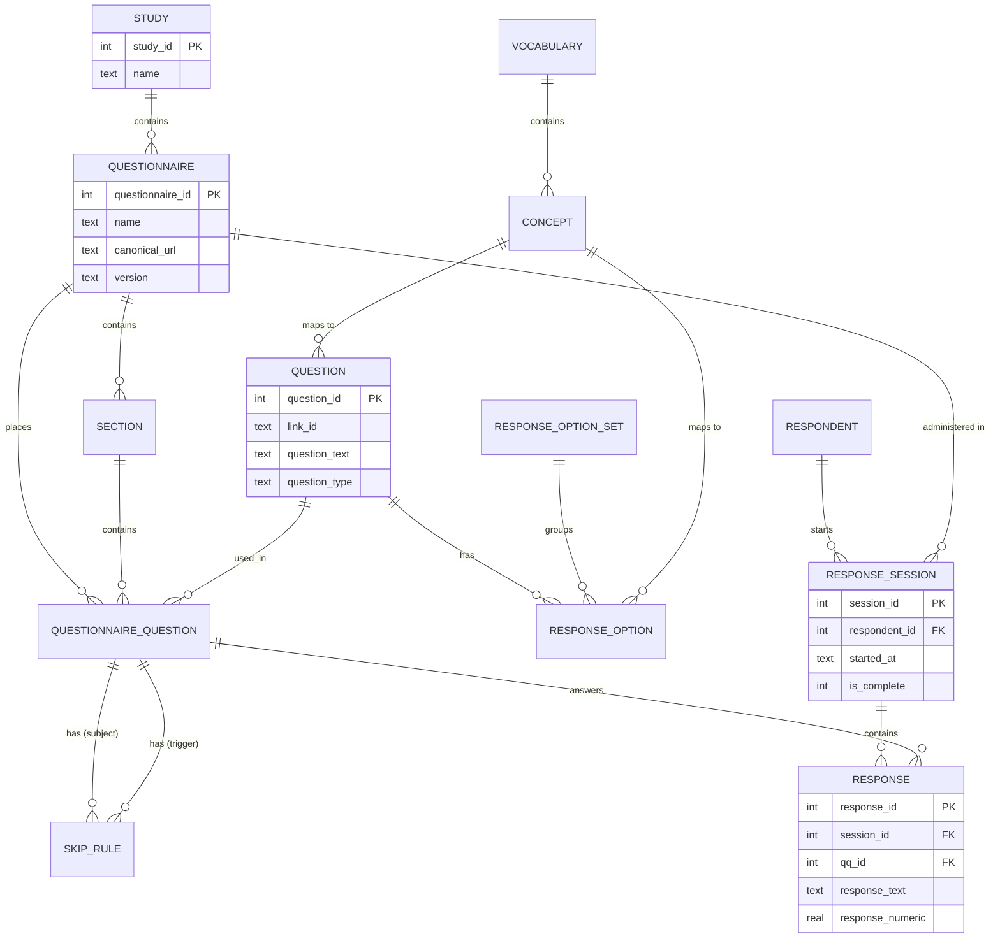

# OLTP Schema (SQLite)

The OLTP schema is designed for structural integrity and transactional safety.

## Diagram

## Key Planes

### Instrument Plane

*   `study`: The top-level container.
*   `questionnaire`: A versioned survey instrument.
*   `section`: A grouping of questions within a questionnaire.
*   `question`: The reusable bank of questions.
*   `questionnaire_question`: The join table that places a question into a questionnaire version.

### Concept Plane

*   `vocabulary`: Standards like LOINC, SNOMED.
*   `concept`: Individual codes from a vocabulary.
*   `concept_relationship`: Maps between concepts (e.g., "Maps to").

### Response Plane

*   `respondent`: Participants in the study.
*   `response_session`: A single attempt to complete a questionnaire.
*   `response`: The individual answers provided by the respondent.
*   `data_quality_flag`: Soft validation errors captured during collection.
