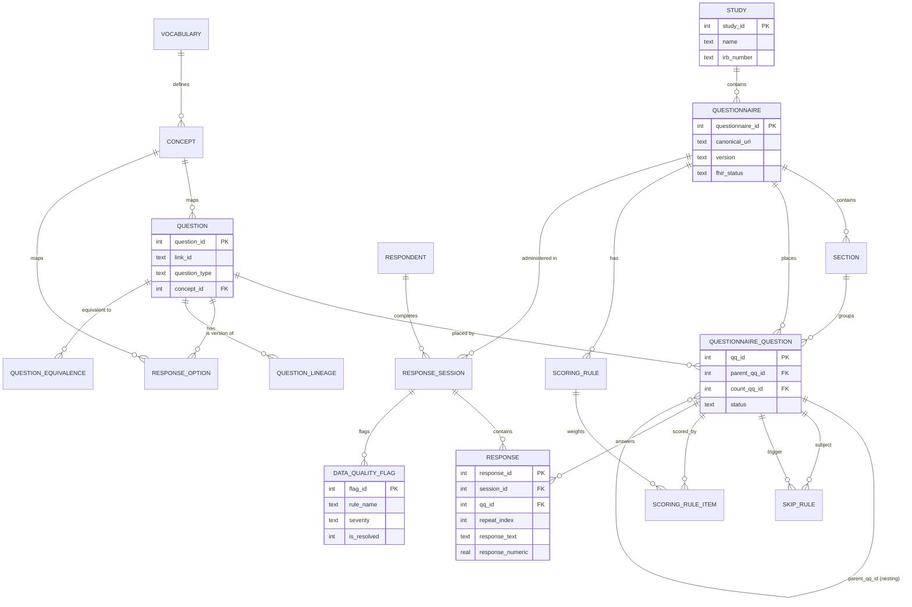

# OLTP Schema (SQLite)

The OLTP database is the **source of truth** for every quickq study. It stores the instrument definition, collected responses, data quality flags, and all administrative and versioning metadata. One `.db` file is the complete portable artifact for a study.

---

## Connection Setup

Every connection must set three pragmas before any reads or writes:

```sql
PRAGMA journal_mode = WAL;      -- safe concurrent reads during writes
PRAGMA foreign_keys = ON;       -- enforce all FK constraints
PRAGMA synchronous = NORMAL;    -- durable without full fsync on every write
```

`foreign_keys = ON` is especially important: all three planes rely on FK constraints to maintain referential integrity, and SQLite disables them by default.

---

## Schema Overview



---

## Instrument Plane

The instrument plane defines *what you are asking*: the hierarchy from study down to individual question options.

### `study`
Top-level container. Holds IRB number and PI name. Multiple questionnaires can belong to the same study.

### `questionnaire`
A versioned survey instrument. `canonical_url` is the FHIR identity URL; `(canonical_url, version)` is the unique composite key. `superseded_by` tracks version lineage.

```
fhir_status: draft | active | retired | unknown
```

### `section`
Optional page/section groupings within a questionnaire. Supports `display_condition` (FHIRPath expression) for conditional sections.

### `question`
The reusable question bank. A question is authored once and can be placed into many questionnaires. `link_id` is stable, human-readable, and maps directly to FHIR `item.linkId`.

| `question_type` | Notes |
|---|---|
| `single_choice` | Radio / MCQ |
| `multiple_choice` | Select all that apply |
| `sata_other` | SATA with free-text "Other" |
| `boolean` | Yes/No |
| `text` | Open-ended string |
| `numeric` | Integer or float; optional `numeric_min/max/step` |
| `date` / `datetime` | ISO 8601 |
| `likert` | Ordered scale |
| `grid` | Matrix; uses `grid_row` + `grid_column` |
| `ranked` | Drag-to-rank |
| `slider` | Visual analog scale |
| `repeating_group` | Loop — same sub-question set repeats N times |

### `questionnaire_question`
The join table that places a question into a questionnaire at a specific position. Key columns:

| Column | Purpose |
|---|---|
| `parent_qq_id` | Sub-question nesting; drives repeating group child hierarchy |
| `count_qq_id` | Links a repeating group to the numeric question driving its repeat count |
| `display_order` | Rendering order within a section |
| `status` | `active` / `deprecated` / `suspended` — questions can be retired mid-study without invalidating historical responses |

### `skip_rule`
Structured branching logic; maps to FHIR `item.enableWhen`. Multiple rules for the same `qq_id` are combined via `enable_behavior` (`all` = AND, `any` = OR). Supported operators: `exists`, `not_exists`, `=`, `!=`, `>`, `<`, `>=`, `<=`.

### `scoring_rule` / `scoring_rule_item` / `scoring_category`
Subscale scoring definitions (PHQ-9 total, GAD-7 severity, SF-12 PCS/MCS). Each rule names a formula (`sum`, `mean`, `count`, or an arithmetic expression). Items can carry weights and reverse-score flags. Categories define severity bands (e.g., "Minimal 0–4, Mild 5–9").

---

## Concept Plane

Every `question`, `response_option`, `grid_row`, and `grid_column` has an optional `concept_id` that maps it to a standard vocabulary (LOINC, SNOMED CT, NCI, BRFSS, or Local).

### `vocabulary`
Metadata for each vocabulary: canonical URL, version. Seeded with LOINC, SNOMED CT, NCI, BRFSS, and Local.

### `concept`
OMOP-inspired concept table. `standard_concept = 'S'` marks the authoritative code; `'C'` marks a classification concept. `(vocabulary_id, concept_code)` is unique.

### `concept_relationship`
Explicit typed edges between concepts: *Maps to*, *Is a*, *Subsumes*, *Answer of*. The same directed-graph pattern used in OMOP.

---

## Response Plane

The response plane records *what respondents answered*.

### `respondent`
De-identified participant record. `external_id` is the researcher-assigned key — never store PII here. `(study_id, external_id)` is unique.

### `response_session`
One session = one attempt to complete one questionnaire. Captures `admin_mode` (web / paper / phone / kiosk / interviewer / api) and `is_proxy` as covariates for mode-effect analysis.

### `response`
One row per answer atom. The encoding rules:

| Question type | Columns used |
|---|---|
| `single_choice` | `option_id` |
| `multiple_choice` / `sata_other` | one row per selected option; `response_text` for "other" text |
| `boolean` | `response_text` = `'true'` or `'false'` |
| `text` | `response_text` |
| `numeric` / `slider` | `response_numeric` |
| `date` / `datetime` | `response_date` (ISO 8601) |
| `grid` | `grid_row_id` + `grid_column_id` + one value column |
| `repeating_group` child | any value column + `repeat_index` (0-based instance index) |

`repeat_index` is `NULL` for all non-repeating answers. For repeating group children it identifies which instance (e.g., which family member, which medication) the answer belongs to.

---

## Data Quality

!!! tip "Never crash on a valid survey"
    Validation errors are written to `data_quality_flag` rather than raising exceptions, keeping data collection robust while creating a complete audit trail.

### `data_quality_flag`
Soft validation failures with `severity` levels (`info`, `warning`, `error`). Each flag is linked to a session and optionally a specific response or questionnaire question. `is_resolved` tracks remediation.

### `study_errata_log`
Human-authored notes about known issues: delivery bugs, question wording errors, IRB-required changes, post-hoc data corrections. Scoped to a date range or session range. Each entry carries `analyst_guidance` — what downstream users must know when working with affected data.

| `event_type` | When to use |
|---|---|
| `delivery_bug` | Platform or tool error affected a batch of responses |
| `question_error` | Wording, translation, or logic mistake in the instrument |
| `deprecation` | Question or questionnaire retired mid-study |
| `correction` | Post-hoc data correction applied |
| `irb_action` | IRB-required modification |
| `note` | General informational entry |

---

## Versioning & Equivalence

These tables are **metadata overlays** — responses are never moved or rewritten. They let analysts declare relationships between questions and instruments while keeping the collection layer immutable.

### `question_lineage`
Tracks intentional revision ancestry. Questions are immutable once created; a rewording or option change always produces a new `question` row linked back here with a typed `change_type` (`reword`, `option_added`, `option_removed`, `split`, `merge`).

### `question_equivalence`
Explicit researcher declarations that two questions measure the same construct. Relationship types: `equivalent`, `near_equivalent`, `related`, `supersedes`. Both directions are stored (like OMOP `concept_relationship`) so queries never need a UNION. `harmonization_notes` records what analysts must know before pooling data.

### `questionnaire_version_diff`
Structured diff between two questionnaire versions: which items were added, removed, reordered, or had skip logic changed. Can be auto-generated by `diff_questionnaire_versions()`.

---

## Interoperability Hooks

The OLTP schema is designed to export to FHIR Questionnaire R4 without loss:

| OLTP column | FHIR field |
|---|---|
| `questionnaire.canonical_url` | `Questionnaire.url` |
| `questionnaire.version` | `Questionnaire.version` |
| `questionnaire.fhir_status` | `Questionnaire.status` |
| `question.link_id` | `item.linkId` |
| `question.question_text` | `item.text` |
| `question.question_type` | `item.type` |
| `response_option.concept_code` + `.concept_system` | `valueCoding.code` + `system` |
| `response_option_set.canonical_url` | `item.answerValueSet` |
| `skip_rule` rows | `item.enableWhen[]` |
| `response_session` | `QuestionnaireResponse` header |
| `response` rows | `QuestionnaireResponse.item[].answer[]` |
| `response.repeat_index` | repeated `item` entries for the same `linkId` |

`questionnaire_question.parent_qq_id` maps to FHIR nested `item` arrays. A `repeating_group` exports as `type: group, repeats: true` with children in its `item` array.

`person_map` bridges `respondent.external_id` to an OMOP `person_id` for studies participating in multi-center networks. It is populated by study-specific ETL, not by quickq itself.
