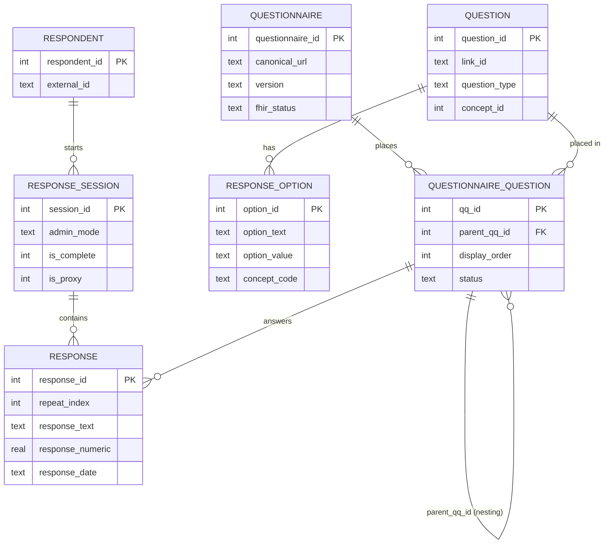

# OLTP Schema (SQLite)

The OLTP database is the **source of truth** for every quickq study. It stores the instrument definition, collected responses, data quality flags, and all administrative and versioning metadata. One `.db` file is the complete portable artifact for a study.

---

## Connection Setup

Every connection must set three pragmas before any reads or writes:

```sql
PRAGMA journal_mode = WAL;      -- safe concurrent reads during writes
PRAGMA foreign_keys = ON;       -- enforce all FK constraints
PRAGMA synchronous = NORMAL;    -- durable without full fsync on every write
```

`foreign_keys = ON` is especially important — SQLite disables FK enforcement by default.

---

## Core Schema

Seven tables handle the essential work: defining an instrument, placing its questions, and recording answers.



**`questionnaire`** — A versioned instrument. `canonical_url` is the FHIR identity; `(canonical_url, version)` is unique. `fhir_status` is `draft | active | retired | unknown`.

**`question`** — The reusable question bank. A question is authored once and placed into any number of questionnaires. `link_id` is the stable human-readable identifier and maps directly to FHIR `item.linkId`. `concept_id` links to the standard vocabulary.

**`questionnaire_question`** — The placement record that puts a question into a questionnaire at a specific position. `parent_qq_id` (self-reference) enables sub-question nesting: children of a `repeating_group` question point their `parent_qq_id` at the group's row. `status` (`active` / `deprecated` / `suspended`) lets items be retired mid-study without invalidating historical responses.

**`response_option`** — Answer choices for closed-ended questions. `concept_code` + `concept_system` are denormalized here for fast FHIR export.

**`respondent`** — De-identified participant. `external_id` is the researcher-assigned key; PII is never stored here.

**`response_session`** — One attempt to complete one questionnaire. `admin_mode` (`web / paper / phone / kiosk / interviewer / api`) and `is_proxy` are first-class fields because mode effects are a real covariate in epi analysis.

**`response`** — One row per answer atom. `repeat_index` (0-based, `NULL` for non-repeating questions) distinguishes instances within a `repeating_group` — e.g., visit 0 vs. visit 1 in a pregnancy log.

| Question type | Columns populated |
|---|---|
| `single_choice` | `option_id` |
| `multiple_choice` / `sata_other` | one row per selected option; `response_text` for "other" |
| `boolean` | `response_text` = `'true'` or `'false'` |
| `text` | `response_text` |
| `numeric` / `slider` | `response_numeric` |
| `date` / `datetime` | `response_date` |
| `grid` | `grid_row_id` + `grid_column_id` + one value column |
| `repeating_group` child | any value column + `repeat_index` |

---

## Supporting Tables

The tables below extend the core with branching logic, scoring, standard vocabularies, data quality, and versioning. They are organized by concern.

### Instrument extras

**`study`** — Top-level container; holds IRB number and PI name. Optional: questionnaires can exist without a `study_id`.

**`section`** — Optional page/section groupings within a questionnaire. Supports `display_condition` (FHIRPath expression) for conditional sections.

**`skip_rule`** — Structured branching logic; maps to FHIR `item.enableWhen`. Multiple rules for the same `qq_id` combine via `enable_behavior` (`all` = AND, `any` = OR). Operators: `exists`, `not_exists`, `=`, `!=`, `>`, `<`, `>=`, `<=`.

**`scoring_rule` / `scoring_rule_item` / `scoring_category`** — Subscale scoring (PHQ-9 total, GAD-7 severity, SF-12). Each rule names a formula (`sum`, `mean`, or an arithmetic expression referencing `link_id` values). Items carry optional weights and reverse-score flags. Categories define severity bands ("Minimal 0–4, Mild 5–9").

**`response_option_set`** — Named option lists shared across questions (e.g., a 5-point frequency scale reused in 9 PHQ items). Maps to FHIR `answerValueSet`.

**`grid_row` / `grid_column`** — Row and column definitions for matrix questions. Both carry optional `concept_id`.

### Concept plane

Every question, option, grid row, and grid column has an optional `concept_id`. The concept model is OMOP-inspired.

**`vocabulary`** — Metadata per vocabulary (LOINC, SNOMED CT, NCI, BRFSS, Local): canonical URL, version.

**`concept`** — Individual standard codes. `standard_concept = 'S'` is the authoritative code; `'C'` is a classification. `(vocabulary_id, concept_code)` is unique.

**`concept_relationship`** — Typed directed edges between concepts: *Maps to*, *Is a*, *Subsumes*, *Answer of*. Same pattern as OMOP CDM.

### Data quality

!!! tip "Never crash on a valid survey"
    Validation issues land in `data_quality_flag` rather than raising exceptions, so collection continues and nothing is lost.

**`data_quality_flag`** — Automated soft validation failures with `severity` (`info / warning / error`). Linked to a session and optionally a specific response or question. `is_resolved` tracks remediation.

**`study_errata_log`** — Human-authored notes: delivery bugs, question errors, IRB actions, post-hoc corrections. Scoped to a session range or date window. Each entry carries `analyst_guidance` — what downstream analysts must know when working with affected data.

| `event_type` | When to use |
|---|---|
| `delivery_bug` | Platform or tool error affected a batch of responses |
| `question_error` | Wording, translation, or logic mistake |
| `deprecation` | Question or instrument retired mid-study |
| `correction` | Post-hoc data correction applied |
| `irb_action` | IRB-required modification |
| `note` | General informational entry |

### Versioning & equivalence

These are **metadata overlays** — responses are never moved or rewritten. They let analysts declare relationships between questions while keeping the collection layer immutable.

**`question_lineage`** — Revision ancestry. Questions are immutable once used; a rewording always produces a new `question` row linked here with a typed `change_type` (`reword`, `option_added`, `option_removed`, `split`, `merge`).

**`question_equivalence`** — Researcher-declared cross-instrument equivalences (`equivalent`, `near_equivalent`, `related`, `supersedes`). Both directions are stored so queries never need a UNION. `harmonization_notes` records what analysts must know before pooling data.

**`questionnaire_version_diff`** — Structured diff between instrument versions: items added, removed, reordered, or changed. Can be auto-generated by `diff_questionnaire_versions()`.

**`person_map`** — Bridges `respondent.external_id` to an OMOP `person_id` for studies in federated networks. Populated by study-specific ETL, not by quickq.

---

## Interoperability Hooks

| OLTP column | FHIR field |
|---|---|
| `questionnaire.canonical_url` | `Questionnaire.url` |
| `questionnaire.version` | `Questionnaire.version` |
| `questionnaire.fhir_status` | `Questionnaire.status` |
| `question.link_id` | `item.linkId` |
| `question.question_type` | `item.type` |
| `response_option.concept_code` + `.concept_system` | `valueCoding.code` + `system` |
| `response_option_set.canonical_url` | `item.answerValueSet` |
| `skip_rule` rows | `item.enableWhen[]` |
| `questionnaire_question.parent_qq_id` | nested `item` arrays |
| `response_session` | `QuestionnaireResponse` header |
| `response.repeat_index` | repeated `item` entries with the same `linkId` |
