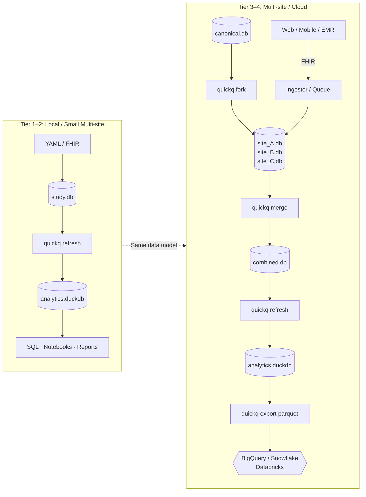

# Design Decisions

At an international workshop, someone asked: *"If we wanted to run a major prospective cohort study in our own country, how would we do that?"*

For the questionnaire layer, the answer should be: receive a `study.db`, deploy collection, refresh analytics. Same instruments, same skip logic, same scoring rules, same analytical queries, same provenance, from a standing start.

That is the standard quickq is designed to clear. Every architectural decision is evaluated against it.

The data model has to outlast any tool used to collect or analyze the data. That rules out architectures where the schema is owned by a platform, generated at runtime, or defined in a spreadsheet that drifts from the data it describes. quickq is an authoring, administration, and analytics layer, not a survey platform.

> *This page lays out the design choices and the use cases they enable. For the schema-level mechanics (planes, refresh model, file layout) see [Architecture](architecture.md). For the underlying invariants that the architecture and the use cases both follow from, see [Design Philosophy](philosophy.md).*

---

## The core architecture

```
YAML / FHIR Questionnaire
        ↓  quickq import / author
   SQLite (study.db)          ← normalized, FHIR-compatible, portable
        ↓  quickq refresh
   DuckDB (analytics.duckdb)  ← star schema, scored, query-ready
        ↓
   SQL · Notebooks · Reports · Parquet export
```

The two-layer design is intentional. The SQLite layer is the source of truth: FHIR-compatible, FK-constrained, suitable for response collection and auditing. The DuckDB layer is purpose-built for analysis: columnar, pre-scored, denormalized into a star schema that is the same for every quickq study. That shared schema is what makes cross-study queries, federated analysis, and institutional warehousing tractable.

---

## Delivery independence

Most platforms lock data collection to their own interface. quickq is headless by design: it produces a FHIR Questionnaire JSON file and accepts a FHIR QuestionnaireResponse JSON file back. What happens in between (a React app, a clinical portal, LHC-Forms, a native mobile app) is not quickq's concern.

This matters in three situations:

- **Multi-channel studies** where the same instrument is administered via web, paper, and clinical system. quickq holds the single authoritative definition; each channel renders it independently.
- **Platform changes mid-study.** If the delivery tool changes, the data model does not. Scoring rules, skip logic, and concept mappings are all in the `.db` file, not in the delivery platform's configuration.
- **Long-term reuse.** A questionnaire authored in quickq can be re-used in a new study years later without re-authoring or re-mapping.

---

## Scales with your study

quickq is designed for a spectrum from a solo PhD project to a multi-site study with 200,000 participants. The data model does not change at any stage.

### Tier 1: Solo or small study (up to ~5,000 participants)

Zero infrastructure. One `.db` file on a laptop. `quickq refresh` takes seconds. Your entire study is one file you can commit to git, back up to a thumb drive, or hand to a collaborator.

### Tier 2: Small multi-site (up to ~20,000 participants)

A single ingestor process imports FHIR responses as they arrive. SQLite with WAL mode sustains thousands of sequential writes per second; the bottleneck is never the database. `quickq refresh` still runs in under a minute.

### Tier 3: Medium multi-site (up to ~100,000 participants)

Each site collects into its own `site_N.db`. A coordinating center distributes the canonical instrument with `quickq fork` (one fork per site, structurally identical, no responses), and a periodic `quickq merge` assembles the populated site databases into a combined study for cross-site analysis. This is the most IRB-friendly pattern: each site retains custody of its own data; only the merged file crosses the institutional boundary. Where central collection is preferred, a queue-backed ingestor serializes concurrent submissions into a single writer.

### Tier 4: Large or institutional (200,000+ participants)

Site sharding remains viable at this scale. For institutions running data through BigQuery, Snowflake, or Databricks, `quickq export parquet` dumps the star schema to Parquet files those warehouses can ingest directly, with no knowledge of quickq required.



---

## Federated analytics

For studies where individual-level data cannot leave each institution's boundary, quickq supports a federated analytics pattern. A coordinating center defines analysis queries against the standard OLAP schema. Each site runs `quickq federated query` locally; only aggregate results (counts, means, distributions) leave the site. Individual rows never move.

This sidesteps the data use agreement and IRB amendment process that direct data sharing requires, which is the primary adoption barrier for multi-institution studies. Because every quickq deployment shares the same `fact_response` / `dim_question` / `dim_respondent` schema, a query written once runs identically at every site.

---

## Data sovereignty and the 10-year rule

Research data needs to be readable not just today but in 10 or 20 years.

**The 10-year rule:** If your research platform shuts down or your institution loses the license, can you still read your data? With cloud platforms, the answer is often "only if you have the CSV export." With quickq, the answer is always yes: SQLite and DuckDB are open-source, widely supported formats readable by any SQL tool, in any language, without quickq installed.

**Point-in-time recovery.** Because a study is a single file, backups are a file copy. Versioned S3 buckets or any snapshotting filesystem give you full point-in-time recovery without database server configuration.

---

## Harmonization across versions and studies

Survey instruments change. IRBs request wording revisions. A useful question turns up in a second study. quickq tracks all of this without touching collected response data:

- **Question lineage:** when a question is revised, the original row is immutable; a new row is created and linked via `record_question_lineage`
- **Equivalence declarations:** `declare_equivalence` marks two questions as analytically equivalent across versions or instruments; `quickq refresh` uses this to set `equivalence_group_id` on the OLAP dimension
- **Cross-version queries:** filter by `equivalence_group_id` in `dim_question` to span all versions of an item in a single query, regardless of which wording a respondent saw

See the [Instrument Versioning & Data Governance](reference/versioning.md) reference for full workflows.

---

## The cost of an ad-hoc data model

The most common alternative to a survey platform is a custom build: a web form or paper form, responses stored as flat CSV files or schemaless JSON, and a separate Excel data dictionary maintained by hand. This path feels cheaper at the start. It becomes expensive the moment analysis begins.

The problems compound over time:

**The wide-table problem.** Every question gets its own column. A study with 10 instruments and 50 questions each produces a table with hundreds or thousands of columns. Analysis requires knowing which column is which, not from the data but from the external data dictionary. Joining two instruments means manually aligning hundreds of column names.

**The disconnected data dictionary.** The Excel sheet describes what the data means. The data file contains the data. They drift apart. Column names change, questions get added, a question is revised mid-study. The Excel sheet is updated inconsistently. By the time analysis begins, the dictionary is partially wrong and nobody is sure which version to trust.

**Per-question data quality.** Range checks, skip logic validation, and missingness analysis have to be written question by question. There is no shared abstraction. There is no way to ask "which Likert questions have unexpected null rates?" because the data model has no concept of question type; every column just has a name.

**Skip logic is invisible.** When a question was correctly skipped, the cell is empty. When a question was genuinely missed, the cell is also empty. Without a record of the skip logic conditions, missingness and correct skipping are indistinguishable. Analysts make assumptions; the assumptions vary.

quickq's architecture is a direct response to these failure modes:

| Problem | Ad-hoc approach | quickq |
|---|---|---|
| Thousands of wide columns | One column per question | `fact_response` — one row per answer atom, typed value columns |
| External data dictionary | Separate Excel sheet | `quickq data-dict` — generated from the schema itself, includes skip conditions and scoring membership |
| Manual concept ID lookup | Look up each column in a sidecar file | Concept codes live on `dim_question` and `dim_response_option` — in the data |
| Per-question QC | Write a new check for every item | `question_type` on `dim_question` — one query covers all Likert questions, all numeric items, etc. |
| Skip logic invisible in data | Indistinguishable from missingness | `skip_rule` table — skip-logic non-response is a query, not a judgment call |
| Scoring logic in analysis scripts | Reimplemented per study, per analyst | Scoring rules in the YAML — computed once on `quickq refresh`, live in `agg_respondent_scores` |
| Instrument definition in a GUI or Word doc | Not version-controllable | YAML — version-controlled alongside your analysis code |

---

## When to use quickq

quickq and platforms like REDCap or Qualtrics solve overlapping problems differently. The right tool depends on what your study needs over its lifetime — and the two are interoperable: quickq's FHIR `Questionnaire` export hands off cleanly to REDCap for delivery, and a `QuestionnaireResponse` returned from REDCap imports directly back into quickq for analysis.

**REDCap and Qualtrics are well-suited when** you want a polished, integrated environment: built-in respondent management, role-based access, e-consent workflows, audit trails, and institutional support. For many studies — especially single-site studies that benefit from a managed platform — they are the right answer.

**quickq is designed for the cases where the study artifact and analytical layer matter as much as the collection interface:**

- Long-term research programs where you want the instrument definition version-controlled alongside the analysis code
- Multi-site studies that need to harmonize data across instrument versions via concept codes (LOINC, SNOMED, OMOP)
- Federated analysis without individual-level data transfer
- Sharing data with institutions that have their own analytics infrastructure (BigQuery, Snowflake, dbt) and need a stable star-schema contract
- Programs where the study should remain readable and runnable years from now without depending on any specific platform's continuity
