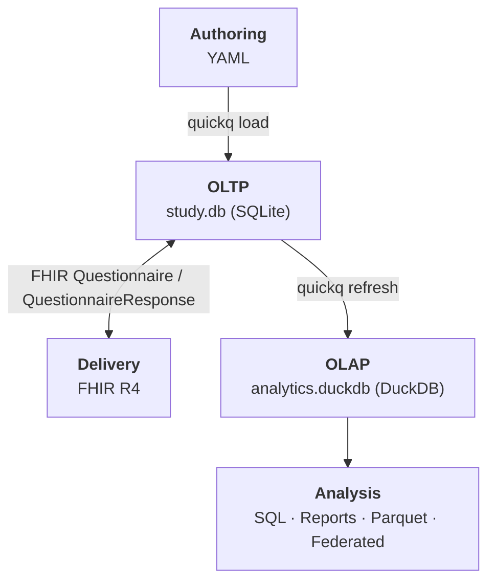

# quickq

quickq is a survey authoring and analytics toolkit for health and epidemiology research, built on two open file formats with no server required.

<div style="max-width: 50%; margin: 0 auto;">



</div>

*A well-designed data model is the best foundation for a survey study.* It encodes claims about what exists in your research, claims that determine what data quality can be enforced at collection time and what analyses become possible later. quickq makes those claims explicit in the two-layer architecture above.

**`study.db` is the portable study artifact.** It is a standard SQLite file. Any SQL tool or language with SQLite bindings can read it directly. The framework is built around open standards:

- Instruments are authored in YAML and validated against existing instruments in the database to avoid duplicating established questions; a preview renderer shows the instrument before deployment
- Delivery is via FHIR. quickq exports a `Questionnaire.json`, any compliant tool renders and collects responses, and quickq ingests the `QuestionnaireResponse.json` back
- Questions and response options carry standard vocabulary codes (LOINC, SNOMED, OMOP) for cross-study harmonization
- A Python SDK provides a clean interface to both databases; the SQLite schema is the contract for non-Python implementations

Together these are the building blocks of a complete, portable, questionnaire-driven study. Hook up a delivery tool, collect responses, and the rest follows from the data model.

**OLTP layer (`study.db`, SQLite): correctness and provenance**

- Questions are immutable once used in a study; a reword or option change produces a new versioned definition, so every response points to exactly what was asked
- Skip logic is stored as structured rules in the database, not in external documentation, making it auditable and testable
- Foreign key constraints and typed response storage enforce integrity at collection time; data quality issues are flagged without interrupting collection

**OLAP layer (`analytics.duckdb`, DuckDB): standardized analysis**

- Every answered question is one row in `fact_response`. The same query pattern works for every question type and every instrument, with no instrument-specific code
- Skip logic violations, out-of-range values, and unexpected missing data are standard SQL queries against the star schema, not custom scripts per instrument
- Subscale scores (PHQ-9, GAD-7, SF-12) are computed from versioned scoring definitions on refresh and can be recomputed against historical data at any time
- Questions and response options carry OMOP-compatible concept IDs; cross-study harmonization of shared LOINC or SNOMED codes is a join

---

## What it does

`quickq --help` shows the full command surface, grouped by purpose:

```text
Core              init · load · preview · serve · refresh · seed · data-dict
                  render · report · analytics · export · list

Study management  fork · merge

FHIR              fhir export · fhir import · fhir import-response

Compliance        compliance pseudonymize · compliance set-metadata
                  compliance fair-check · compliance export-metadata
                  compliance delete · compliance withdraw

Federated         federated query
```

A complete study lifecycle uses commands from each group:

- **Core** authors the instrument, collects responses, and produces analytical outputs (reports, exports, scoring, the DuckDB UI via `quickq analytics`).
- **Study management** combines and divides study databases. `quickq fork` scaffolds a new study database from an existing one's structure (questions, options, scoring rules) without copying responses; useful for multi-site distribution, dev/staging environments, or generational handoff. `quickq merge` is the inverse: combine multiple site databases into a single combined study.
- **FHIR** is the cross-language handoff. Export a `Questionnaire` JSON for any FHIR-compatible delivery tool (LHC-Forms, REDCap, a custom mobile app), then import the `QuestionnaireResponse` back.
- **Compliance** prepares data for sharing under HIPAA, GDPR, and IRB constraints: pseudonymization, FAIR metadata, machine-readable repository deposits, participant withdrawal and erasure.
- **Federated** runs aggregate queries across multiple site databases without ever moving individual-level records, with cell-size suppression for disclosure control.

---

## Quick Start

```bash
# Install quickq and the bundled form server
uv tool install --reinstall ./quickq --with ./quickq-forms

# Author a study
quickq init study.db --with-library             # OLTP database + standard instrument library
quickq load instrument.yaml study.db            # add your YAML instrument
quickq serve study.db                           # launch the form server in your browser

# Build and inspect the analytics layer
quickq refresh study.db analytics.duckdb        # OLTP → OLAP star schema
quickq report  analytics.duckdb study.db 1      # Markdown summary
quickq analytics                                # interactive DuckDB UI in your browser
```

For a copy-paste-runnable walkthrough that authors a complete questionnaire from scratch, see the [End-to-End Walkthrough](tutorials/end-to-end.md).

Authoring from YAML:

```yaml
questionnaire:
  name: PHQ-9
  version: "1.0"
  canonical_url: http://quickq.io/instruments/phq-9

  questions:
    - link_id: phq-1
      text: Little interest or pleasure in doing things?
      type: single_choice
      concept: LOINC:44250-9
      required: true
      options:
        - { text: "Not at all",              value: "0", concept: LOINC:LA6568-5 }
        - { text: "Several days",            value: "1", concept: LOINC:LA6569-3 }
        - { text: "More than half the days", value: "2", concept: LOINC:LA6570-1 }
        - { text: "Nearly every day",        value: "3", concept: LOINC:LA6571-9 }
```

---

## What quickq is not

- A patient portal or EMR integration layer. quickq exports FHIR and ingests it back; integration is the delivery tool's job
- An always-on service. The refresh model is batch and on-demand, appropriate for research use
- A replacement for managed survey platforms. REDCap and Qualtrics solve overlapping problems with built-in respondent management, role-based access, and institutional support; the right tool depends on what your study needs over its lifetime. See [When to use quickq](design_decisions.md#when-to-use-quickq).

---

## Going deeper

- [End-to-End Walkthrough](tutorials/end-to-end.md) — copy-paste runnable; build a study from scratch in about 15 minutes
- [The Study Journey](tutorial.md) — phase-by-phase tour of a researcher's workflow against the demo database
- [Design Decisions](design_decisions.md) — delivery independence, scaling patterns, federated analytics, data sovereignty
- [Survey Authoring](authoring.md) — YAML format, question types, skip logic, scoring rules, concept mapping
- [Architecture](architecture.md) — schema, refresh model, FHIR handoff details
