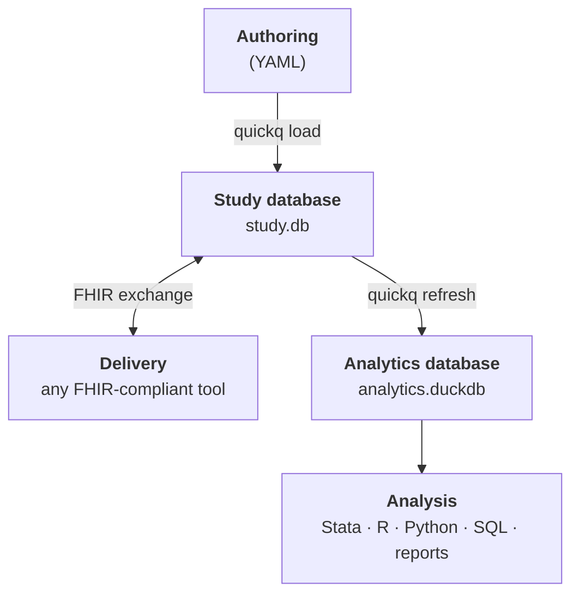

# quickq

**quickq is a survey authoring and analytics toolkit for health and epidemiology research.** Author instruments once, collect responses through a bundled web form (or hand the export to REDCap or any other FHIR-compliant tool), and analyze in whatever stats environment you already use — Stata, R, Python, or SQL.

The defining choice: every study lives in a single, portable file (`study.db`). Hand a collaborator that file and they have the complete study — instrument definitions, scoring rules, responses, audit trail. No proprietary platform, no vendor relationship, no losing the thread back to the original study.

## When quickq fits, when REDCap fits

quickq isn't trying to replace REDCap — it solves overlapping problems with different tradeoffs. Honest framing:

**quickq is the right pick when:**

- Your study runs for years and you want the instrument **version-controlled alongside your analysis code**, not behind a clicking-around UI
- You're running **multi-site research** and need every site to use the same canonical instrument with the same analytical shape
- You want a **single archival file** that survives postdocs leaving, institutional access expiring, or vendor pricing changes
- You're depositing in a FAIR repository and need machine-readable provenance

**REDCap (or Qualtrics) is the right pick when:**

- You need polished respondent management, e-consent, role-based access, and your institution's IT support
- You're a single-site team that doesn't care about archival portability past the study's end
- You're new to programming and need a clickable UI for everything

The two tools coexist gracefully. quickq exports FHIR Questionnaire JSON that REDCap can import; REDCap exports FHIR QuestionnaireResponse JSON that quickq can ingest. Several teams use quickq for authoring + archival, REDCap for collection.

## See what you'd write

quickq's authoring format is YAML — plain text, indented, readable. A question looks like this:

```yaml
- link_id: phq.1
  text: Little interest or pleasure in doing things?
  type: single_choice
  required: true
  options:
    - { text: "Not at all",   value: "0" }
    - { text: "Several days", value: "1" }
    - { text: "More than half the days", value: "2" }
    - { text: "Nearly every day", value: "3" }
```

A whole questionnaire is a list of those. You can also drop in validated scales from the bundled library (PHQ-9, GAD-7, AUDIT-10, PRAPARE, PROMIS-10, …) with one line:

```yaml
- { library: phq9.1 }
```

That pulls in the question text, the LOINC code, and the standard option set — already validated against the published scale.

## What you get

- **Bundled instrument library.** PHQ-9, GAD-7, AUDIT-10, PRAPARE, PROMIS-10, and more — ready to drop into a study. Compose your own instruments by referencing library questions, or author from scratch in YAML.
- **Delivery that isn't locked to one tool.** The bundled `quickq-forms` web app renders your instrument in a browser. Or export to FHIR (a healthcare data standard) and hand it to REDCap, LHC-Forms, a custom mobile app, or any FHIR-compliant tool — responses flow back the same way. Your study is portable to any tool the institution standardizes on.
- **A data dictionary that can't drift.** `quickq data-dict` reads the live schema and emits question text, types, concept codes, valid responses, skip conditions, and scoring memberships — generated from the data, not maintained alongside it.
- **Skip logic + QC that distinguishes shown-but-skipped from never-asked.** "Did the respondent decline to answer item 7, or did the skip logic hide it because they answered no to item 6?" quickq tracks both as first-class data; you don't have to reconstruct the distinction in your analysis code.
- **Validated scoring computed automatically.** PHQ-9 total + severity band, GAD-7 anxiety category, AUDIT alcohol-use score, custom scoring rules — all computed during `quickq refresh` so a query for "mean PHQ-9 by site" is one line.
- **Versioning and provenance.** Questions are immutable once used; rewording or changing an option produces a new versioned definition, so every response points to exactly what was asked.
- **Multi-site studies.** `quickq fork` distributes a canonical instrument to N sites; `quickq merge` brings the populated databases back. Or run **federated queries** across sites without moving individual records. See [Multi-site studies](reference/multi-site.md).
- **Compliance scaffolding.** FAIR self-audit, GDPR-style erasure, IRB-style withdrawal, and metadata export are first-class commands aligned with HIPAA, GDPR, and IRB conventions.

## Try it in 5 minutes

```bash
# Install quickq with the bundled form server.
# (uv is Astral's Python tool installer — like pip, but isolates each tool.
#  Install via: brew install uv  or  curl -LsSf https://astral.sh/uv/install.sh | sh)
uv tool install git+https://github.com/quickq-io/quickq.git \
    --with git+https://github.com/quickq-io/quickq-forms.git

# Author and serve a study
quickq init study.db --with-library          # study database + standard instrument library
quickq load instrument.yaml study.db         # compile your YAML instrument
quickq serve study.db                        # launch the form server in your browser

# Build and inspect the analytics layer
quickq refresh study.db analytics.duckdb     # build the analytics database from the study
quickq report  analytics.duckdb study.db 1   # Markdown summary
```

For a copy-paste-runnable walkthrough that builds a complete study from scratch in about 15 minutes, see the [End-to-End Walkthrough](tutorials/end-to-end.md).

## Analyze in the tools you already use

quickq's analytics layer is a standard DuckDB file (`analytics.duckdb`). DuckDB can be opened directly from R, Python, Julia, and the command line — no SQL knowledge required if you don't want it.

```bash
# Export the star schema as Parquet files for any tool that reads them
quickq export parquet analytics.duckdb -o data/
```

```r
# In R — read the Parquet exports
library(arrow)
responses <- read_parquet("data/fact_response.parquet")
scores    <- read_parquet("data/agg_respondent_scores.parquet")
# or query DuckDB directly via duckdb-r
library(duckdb); con <- dbConnect(duckdb::duckdb(), "analytics.duckdb")
respondents <- dbGetQuery(con, "SELECT * FROM dim_respondent")
```

```python
# In Python — read the Parquet exports
import pandas as pd
responses = pd.read_parquet("data/fact_response.parquet")
scores    = pd.read_parquet("data/agg_respondent_scores.parquet")
# or query DuckDB directly
import duckdb
con = duckdb.connect("analytics.duckdb")
respondents = con.execute("SELECT * FROM dim_respondent").df()
```

If you do write SQL, the analytics layer rewards you: every quickq study has the same schema, so the same query works across studies. See [Query Patterns by Question Type](reference/query-patterns.md) for the canonical recipes.

## How quickq fits together

<div style="max-width: 50%; margin: 0 auto;">



</div>

Two databases connected by a `refresh` step. **`study.db`** is the source of truth — your instruments, your responses, your audit trail, in one file. **`analytics.duckdb`** is rebuilt from it on demand, in a shape designed for analytical queries (every quickq study has the same schema, so the same query works across studies).

Both files are standard, single-file SQLite and DuckDB databases — readable by any SQL tool in any language, with or without quickq installed. The framework around them is built on open standards:

- Instruments are authored in YAML, validated against existing library content, and previewable before deployment.
- Delivery is via FHIR R4 (a healthcare data standard). quickq exports `Questionnaire` JSON, any compliant tool collects responses, quickq ingests `QuestionnaireResponse` JSON back.
- Questions and options carry standard vocabulary codes (LOINC, SNOMED, OMOP) for cross-study harmonization.

## What it does

`quickq --help` shows the full command surface, grouped by purpose:

```text
Core              new · init · load · preview · serve · refresh · seed · data-dict
                  render · report · analytics · export · list

Study management  fork · merge

FHIR              fhir export · fhir import · fhir import-response

Compliance        compliance set-metadata · compliance fair-check
                  compliance export-metadata · compliance delete
                  compliance withdraw

Federated         federated query
```

- **Core** scaffolds the study repository, authors the instrument, collects responses, and produces analytical outputs.
- **Study management** distributes and combines studies. [`quickq fork`](reference/multi-site.md) scaffolds a new study from an existing one's structure (questions, scoring rules) without copying responses. [`quickq merge`](reference/multi-site.md) is the inverse.
- **FHIR** is the cross-tool handoff. See [Third-party FHIR renderers](reference/third-party-renderers.md).
- **Compliance** supports common research-data workflows aligned with HIPAA, GDPR, and IRB conventions.
- **Federated** runs aggregate queries across multiple site databases without ever moving individual-level records, with cell-size suppression for disclosure control.

## Why this stays simple

The foundation of quickq is a small, well-shaped data model. That shape is what makes standardization, analysis, and quality control simple SQL queries rather than separate workflows: the data dictionary is a query, skip-logic QC is a query, cross-study harmonization is a JOIN. The data is already in a form that's easy to reason about, so dictionaries, catalogs, and scoring rules don't have to be maintained alongside it — they're views of the model itself.

Four concrete consequences:

- **Skip logic is structured rows in `skip_rule`, not prose in a PDF.** Eligibility, integrity, and the structurally-missing / truly-missing distinction are SQL recipes that work across every instrument unchanged. See [Skip-Logic Recipes](reference/skip-logic-qc.md).
- **The data dictionary is a query, not a Word document.** `quickq data-dict` reads the live schema and emits a complete, up-to-date dictionary that can't drift from the data because it *is* the data. See the [PRAPARE Data Dictionary](reference/example-prapare-data-dict.md) for a worked example.
- **Every question type stores answers in `fact_response` the same way.** Choice answers in `option_id` and `option_value`, numeric in `response_numeric`, date in `response_date`, text in `response_text`. The same query shape works for single_choice, multiple_choice, likert, boolean, numeric, date, slider, ranked, and grid questions, with no instrument-specific code. See [Query Patterns by Question Type](reference/query-patterns.md).
- **Scoring is data, not code.** Scoring rules declared in YAML at authoring time produce `agg_respondent_scores` rows during refresh — one per respondent × rule. "Mean PHQ-9 score by site" is `SELECT mean(score_raw) FROM agg_respondent_scores GROUP BY site` against a table that's always current, not a custom analysis pipeline that has to be rewritten for each new instrument.

The alternative — skip logic in delivery configs, data dictionaries in Word, custom storage per question type, completion rates that hand-encode the rules — turns every analytical question into a model-reconstruction exercise. Every analyst rebuilds the same understanding from the same sidecar documents, every reproduction is an opportunity for drift, every audit is a manual diff between artifacts that should have been one. quickq treats those reconstructions as the design smell they are.

Scoring rules, concept codes, errata, lineage between question versions, and the data-quality flags raised at collection time follow the same pattern: they are first-class rows in the model, not annotations bolted onto it later.

!!! tip "Going further on the data model"
    For the full schema with ER diagrams, see the **[Data Model overview](database/data-model.md)** — eight logical layers across the study source-of-truth and the analytical projection, with diagrams for the four that carry the most analytical weight.

## What quickq is not

- A patient portal or EMR integration layer. quickq exports FHIR and ingests it back; integration is the delivery tool's job.
- An always-on service. The refresh model is batch and on-demand, appropriate for research use.
- A managed survey platform. See the comparison above — REDCap, Qualtrics, and quickq each solve overlapping problems with different tradeoffs.

## Going deeper

- [End-to-End Walkthrough](tutorials/end-to-end.md) — copy-paste runnable; build a study from scratch in about 15 minutes.
- [The Study Journey](tutorial.md) — phase-by-phase tour of a researcher's workflow against the demo database.
- [Design Decisions](design_decisions.md) — delivery independence, scaling patterns, federated analytics, data sovereignty.
- [Survey Authoring](authoring.md) — YAML format, question types, skip logic, scoring rules, concept mapping.
- [Architecture](architecture.md) — schema, refresh model, FHIR handoff details.
