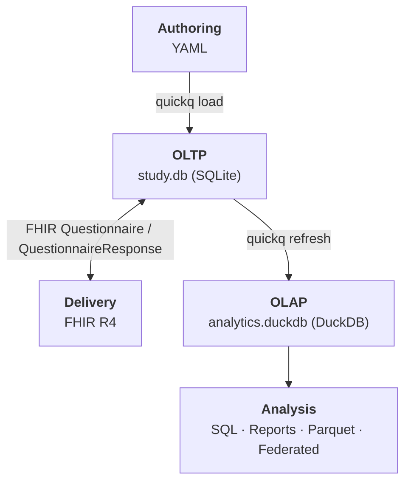

# quickq

**quickq is a survey authoring and analytics toolkit for health and epidemiology research.** Author instruments in YAML, deliver them over FHIR, collect responses through a bundled web form, and analyze with SQL — all from one command-line tool, with a shared data model underneath that keeps every artifact in sync.

## What you get

- **Bundled instrument library.** PHQ-9, GAD-7, AUDIT-10, PRAPARE, PROMIS-10, and more — ready to drop into a study. Compose your own instruments by referencing library questions, or author from scratch in YAML.
- **FHIR-compliant delivery.** The bundled `quickq-forms` web app renders your instrument in a browser; or hand the FHIR export to REDCap, LHC-Forms, a custom mobile app, or any FHIR-compliant tool. Responses flow back the same way.
- **A data dictionary that can't drift.** `quickq data-dict` reads the live schema and emits question text, types, concept codes, valid responses, skip conditions, and scoring memberships — generated from the data, not maintained alongside it.
- **Skip logic and QC as queries.** Eligibility, integrity violations, and the structurally-missing-vs-truly-missing distinction are SQL recipes that work across every instrument unchanged.
- **Versioning and provenance.** Questions are immutable once used; rewording or changing an option produces a new versioned definition, so every response points to exactly what was asked.
- **Federated analytics + concept harmonization.** Aggregate queries across multi-site databases without moving individual records. Questions and response options carry LOINC, SNOMED, and OMOP codes for cross-study harmonization.
- **Compliance scaffolding.** FAIR self-audit, GDPR-style erasure, IRB-style withdrawal, and metadata export are first-class commands aligned with HIPAA, GDPR, and IRB conventions.

---

## Quick Start

```bash
# Install quickq with the bundled form server
uv tool install git+https://github.com/quickq-io/quickq.git \
    --with git+https://github.com/quickq-io/quickq-forms.git

# Author and serve a study
quickq init study.db --with-library          # OLTP database + standard instrument library
quickq load instrument.yaml study.db         # compile your YAML instrument
quickq serve study.db                        # launch the form server in your browser

# Build and inspect the analytics layer
quickq refresh study.db analytics.duckdb     # OLTP → OLAP star schema
quickq report  analytics.duckdb study.db 1   # Markdown summary
quickq analytics                             # interactive DuckDB UI (requires duckdb on PATH)
```

For a copy-paste-runnable walkthrough that builds a complete study from scratch in about 15 minutes, see the [End-to-End Walkthrough](tutorials/end-to-end.md).

---

## How quickq fits together

<div style="max-width: 50%; margin: 0 auto;">



</div>

Two databases connected by a refresh. `study.db` (SQLite) is the *source of truth* — normalized, FK-constrained, FHIR-compatible, the file that gets backed up, version-controlled, and handed to collaborators. `analytics.duckdb` (DuckDB) is the *analytical contract* — a star schema rebuilt on demand from the OLTP, with the same shape for every quickq study so the same query works against any of them.

**`study.db` is the portable study artifact.** It's a standard SQLite file readable by any SQL tool or language with SQLite bindings. The framework around it is built on open standards:

- Instruments are authored in YAML and validated against existing library content to avoid duplicating established questions; a preview renderer shows the instrument before deployment.
- Delivery is via FHIR R4. quickq exports a `Questionnaire.json`, any compliant tool renders and collects responses, and quickq ingests the resulting `QuestionnaireResponse.json` back.
- Questions and response options carry standard vocabulary codes (LOINC, SNOMED, OMOP) for cross-study harmonization.
- A Python SDK provides a clean interface to both databases; the SQLite schema is the contract for non-Python implementations.

---

## What it does

`quickq --help` shows the full command surface, grouped by purpose:

```text
Core              new · init · load · preview · serve · refresh · seed · data-dict
                  render · report · analytics · export · list

Study management  fork · merge

FHIR              fhir export · fhir import · fhir import-response

Compliance        compliance set-metadata · compliance fair-check
                  compliance export-metadata · compliance delete
                  compliance withdraw

Federated         federated query
```

A complete study lifecycle uses commands from each group:

- **Core** scaffolds the study repository, authors the instrument, collects responses, and produces analytical outputs (reports, exports, scoring, the DuckDB UI via `quickq analytics`).
- **Study management** combines and divides study databases. `quickq fork` scaffolds a new study database from an existing one's structure (questions, options, scoring rules) without copying responses — useful for multi-site distribution, dev/staging environments, or generational handoff. `quickq merge` is the inverse: combine multiple site databases into a single combined study.
- **FHIR** is the cross-language handoff. Export a `Questionnaire` JSON for any FHIR-compatible delivery tool (LHC-Forms, REDCap, a custom mobile app), then import the `QuestionnaireResponse` back. See [Third-party FHIR renderers](reference/third-party-renderers.md).
- **Compliance** supports common research-data workflows aligned with HIPAA, GDPR, and IRB conventions: FAIR-aligned metadata for repository deposit, a FAIR self-audit, GDPR-style erasure, and IRB-style withdrawal. These commands implement specific mechanical operations and assist compliance work; they do not certify that your deployment meets any framework on its own.
- **Federated** runs aggregate queries across multiple site databases without ever moving individual-level records, with cell-size suppression for disclosure control.

---

## Why this stays simple

The foundation of quickq is a small, well-shaped data model. That shape is what makes standardization, analysis, and quality control simple SQL queries rather than separate workflows: the data dictionary is a query, skip-logic QC is a query, cross-study harmonization is a JOIN. The data is already in a form that's easy to reason about, so dictionaries, catalogs, and scoring rules don't have to be maintained alongside it — they're views of the model itself.

Three concrete consequences:

- **Skip logic is structured rows in `skip_rule`, not prose in a PDF.** Eligibility, integrity, and the structurally-missing / truly-missing distinction are SQL recipes that work across every instrument unchanged. See [Skip-Logic Recipes](reference/skip-logic-qc.md).
- **The data dictionary is a query, not a Word document.** `quickq data-dict` reads the live schema and emits a complete, up-to-date dictionary that can't drift from the data because it *is* the data. See the [PRAPARE Data Dictionary](reference/example-prapare-data-dict.md) for a worked example.
- **Every question type stores answers in `fact_response` the same way.** Choice answers in `option_id` and `option_value`, numeric in `response_numeric`, date in `response_date`, text in `response_text`. The same query shape works for single_choice, multiple_choice, likert, boolean, numeric, date, slider, ranked, and grid questions, with no instrument-specific code. See [Query Patterns by Question Type](reference/query-patterns.md).

The alternative — skip logic in delivery configs, data dictionaries in Word, custom storage per question type, completion rates that hand-encode the rules — turns every analytical question into a model-reconstruction exercise. Every analyst rebuilds the same understanding from the same sidecar documents, every reproduction is an opportunity for drift, every audit is a manual diff between artifacts that should have been one. quickq treats those reconstructions as the design smell they are.

Scoring rules, concept codes, errata, lineage between question versions, and the data-quality flags raised at collection time follow the same pattern: they are first-class rows in the model, not annotations bolted onto it later.

!!! tip "Going further on the data model"
    For the full schema with ER diagrams, see the **[Data Model overview](database/data-model.md)** — eight logical layers across the OLTP source-of-truth and the OLAP analytical projection, with diagrams for the four that carry the most analytical weight.

---

## Authoring example

```yaml
questionnaire:
  name: PHQ-9
  version: "1.0"
  canonical_url: http://quickq.io/instruments/phq-9

  option_sets:
    phq_frequency:
      - { text: "Not at all",              value: "0", concept: LOINC:LA6568-5 }
      - { text: "Several days",            value: "1", concept: LOINC:LA6569-3 }
      - { text: "More than half the days", value: "2", concept: LOINC:LA6570-1 }
      - { text: "Nearly every day",        value: "3", concept: LOINC:LA6571-9 }

  questions:
    - link_id: phq-1
      text: Little interest or pleasure in doing things?
      type: single_choice
      concept: LOINC:44250-9
      required: true
      options: $phq_frequency

    - link_id: phq-2
      text: Feeling down, depressed, or hopeless?
      type: single_choice
      concept: LOINC:44255-8
      required: true
      options: $phq_frequency
```

---

## What quickq is not

- A patient portal or EMR integration layer. quickq exports FHIR and ingests it back; integration is the delivery tool's job.
- An always-on service. The refresh model is batch and on-demand, appropriate for research use.
- A replacement for managed survey platforms. REDCap and Qualtrics solve overlapping problems with built-in respondent management, role-based access, and institutional support; the right tool depends on what your study needs over its lifetime. See [When to use quickq](design_decisions.md#when-to-use-quickq).

---

## Going deeper

- [End-to-End Walkthrough](tutorials/end-to-end.md) — copy-paste runnable; build a study from scratch in about 15 minutes.
- [The Study Journey](tutorial.md) — phase-by-phase tour of a researcher's workflow against the demo database.
- [Design Decisions](design_decisions.md) — delivery independence, scaling patterns, federated analytics, data sovereignty.
- [Survey Authoring](authoring.md) — YAML format, question types, skip logic, scoring rules, concept mapping.
- [Architecture](architecture.md) — schema, refresh model, FHIR handoff details.
